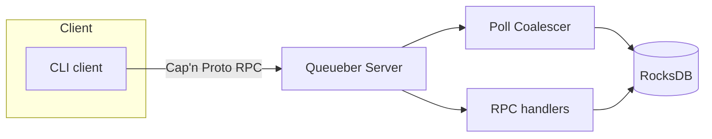

Queueber
========

A simple queue server and client built with Cap'n Proto RPC and RocksDB.

Prerequisites
-------------

- Rust (nightly toolchain; e.g., `rustup default nightly`)
- Cap'n Proto CLI (`capnp`) version 0.5.2 or newer
  - Install instructions: https://capnproto.org/install.html
  - Ensure `capnp` is on your PATH; the build script will fail without it.
- libclang-19-dev (for RocksDB bindings)

Build
-----

```
cargo build
```

If you see a schema compilation error from the build script, install the Cap'n Proto CLI as noted above and rebuild.

Getting Started
---------------

1. Start the server (defaults to `127.0.0.1:9090` and data dir `/tmp/queueber/data`):
   ```
   cargo run --bin queueber
   ```
2. In another shell, add an item:
   ```
   cargo run --bin client -- add --contents "hello" --visibility 1
   ```
3. Poll for items:
   ```
   cargo run --bin client -- poll --num 1 --timeout 3
   ```

Running
-------

- Server:
  - Defaults: `127.0.0.1:9090`, data dir `/tmp/queueber/data`
  - Example:
    ```
    cargo run --bin queueber -- --listen 0.0.0.0:9090 --data-dir /var/lib/queueber
    ```

- Client (add one item):
  ```
  cargo run --bin client -- --addr localhost:9090 add --contents "hello" --visibility 10
  ```

Docker
------

- Build the image:
  ```
  docker build -t queueber:latest .
  ```
- Run the server (maps 9090, persists data to a local dir):
  ```
  mkdir -p ./data && \
  docker run --rm -p 9090:9090 -v $(pwd)/data:/data queueber:latest
  ```

RPC definition
--------------

- The Cap'n Proto RPC schema lives at [queueber.capnp](./queueber.capnp). It is compiled at build time by the build script, and the generated Rust types are re-exported from `src/protocol.rs`.

Performance
-----------

- Poll coalescing batches concurrent `poll` requests into a single RocksDB transaction and fairly distributes results back, reducing contention under load. See [docs/poll_coalescing_sketch.md](./docs/poll_coalescing_sketch.md).
- The server uses a top-level Tokio runtime to accept connections and a pool of worker threads for RPC handling; RocksDB is used for durable storage. Detailed notes and tuning suggestions (threading, wakeups, RocksDB options) are in [docs/perf-notes.md](./docs/perf-notes.md).
- To generate load, use the built-in stress client:
  ```
  cargo run --bin client -- stress --polling-clients 4 --adding-clients 4 --rate 500 --duration 60
  ```
- Additional storage layout notes are in [docs/rocksdb-column-families.md](./docs/rocksdb-column-families.md).

Design overview
---------------


